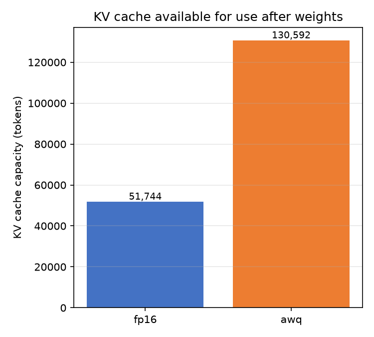
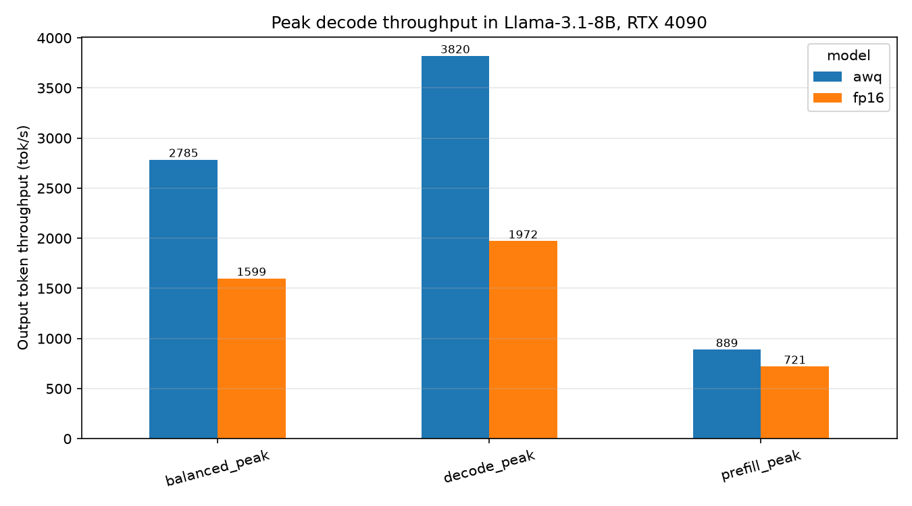
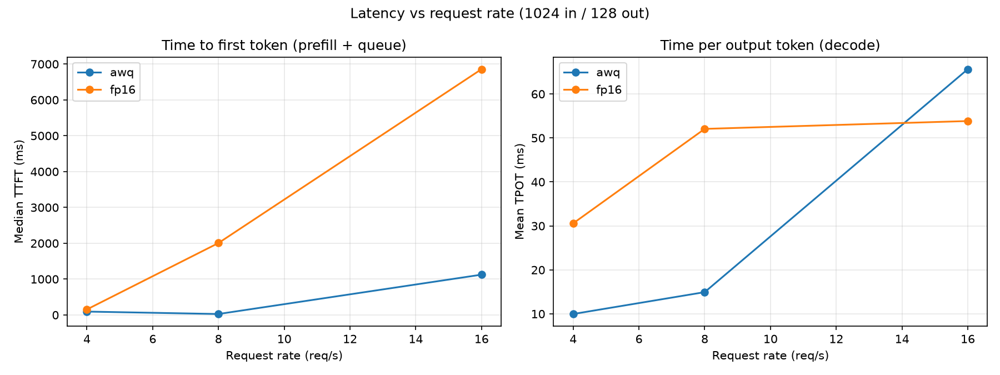

# LLM inference on one RTX 4090

I wanted to know where the time actually goes when vLLM serves an 8B model on a
single consumer GPU, and how much 4-bit quantization really buys. So I made an artifact that measures
it in 3 different ways: serving requests, offline decode, and per-kernel hardware counters.

The short version: quantization does remove the memory bottleneck, but it does
not deliver the speedup you'd expect from the bytes it saves, and the reason
turns out to be the launch configuration of one kernel.

**Setup.** RTX 4090 (24 GB, 1008 GB/s), vLLM 0.26, Llama-3.1-8B-Instruct in
BF16 and in AWQ-INT4. Nsight Compute for kernel counters.

## 1. Serving benchmarks

`serving.sh` runs a vLLM server per model and fires six request patterns at it. Both
models get the same memory budget (0.9), otherwise the cache numbers aren't comparable.

**KV cache.** BF16 weights take about 15 GB of the card, which leaves 5.53 GB
for the KV cache, around 45,264 tokens. AWQ weights take 5.4 GB, leaving 124,048
tokens. That's 2.74x more availability, and I found this matters because the cache size is what
limits how many requests can run at once.



Divide cache size by token count and both models land on the same figure: 128 KB
of cache per token. They match because only the weights are quantized. The KV
cache stays 16-bit either way.

That 128 KB is worth unpacking, because it's the number that decides how many
requests fit. Every layer stores one key and one value per token, and this model
has 32 layers, 8 KV heads, and 128 dimensions per head:

```
2 (key + value) x 8 heads x 128 dims x 2 bytes = 4 KB per layer
4 KB x 32 layers                               = 128 KB per token
```

The 8 is the part that matters. The model can run 32 attention heads but keeps only
8 sets of keys and values, sharing each set across 4 heads. That's what
grouped-query attention means. If every head had its own set, a token would cost
512 KB instead of 128 KB, and this card would hold a quarter as many sequences.

**Throughput.** How much AWQ wins depends entirely on the shape of the work:

| Request shape | BF16 (tokens/s) | AWQ (tokens/s) | Speedup |
|---|---|---|---|
| 1024 in, 128 out | 720 | 889 | 1.23x |
| 512 in, 512 out | 1,599 | 2,785 | 1.74x |
| 256 in, 1024 out | 1,972 | 3,820 | 1.94x |

Prefill barely improves. That phase does big matrix multiplies and is limited by
compute, so reading fewer weight bytes doesn't help much, and INT4 has to be
unpacked before the math anyway. Decode is where the win is, because there the
GPU spends its time streaming weights out of memory.

**Latency.** Under a fixed arrival rate the picture flips at high load:

| Requests/s | BF16 TPOT | AWQ TPOT |
|---|---|---|
| 4 | 30.6 ms | 10.0 ms |
| 8 | 52.1 | 14.9 |
| 16 | 53.8 | **65.6** |

At 16 req/s AWQ is worse per token, but still finishes more work overall (1,180
vs 711 tok/s) and starts replying far sooner (median TTFT 1.1 s vs 6.9 s). The
reason is its bigger cache: BF16 runs out of room and can't admit more requests,
so its per-token time flattens out, while AWQ keeps accepting them into larger
and larger batches. Bigger batches mean slower steps but more tokens per step.




## 2. Offline decode

`decode.py` skips the HTTP server and runs a fixed batch in-process, which makes
the numbers easier to reason about. Batch 64, 128-token prompts, 256 tokens out.

| | tok/s | Step | Weight bytes/step | Share of 1008 GB/s |
|---|---|---|---|---|
| BF16, CUDA graphs | 3,110 | 20.6 ms | 16.11 GB | 78% |
| BF16, eager | 3,026 | 21.2 ms | 16.11 GB | 76% |
| AWQ, CUDA graphs | 5,975 | 10.7 ms | 5.79 GB | 54% |
| AWQ, eager | 5,747 | 11.1 ms | 5.79 GB | 52% |

Two conclusions:

CUDA graphs are worth 3-4%. I'd assumed more, and I was wrong.

The important one: **AWQ reads 2.78x fewer bytes but only runs 1.92x faster.**
BF16 is close to the memory ceiling at 78%, so there's not much left to offer there. AWQ is at 54%, which means something other than bandwidth is holding it back. Adding KV traffic to the estimate pushes BF16 to roughly 88%
and AWQ to 74%, so the gap stays.

## 3. Kernel counters

`roofline.sh` profiles four configurations with Nsight Compute. In every one,
the linear-layer GEMMs take 86-89% of kernel time. Attention takes about 9% and
runs at 6% of peak bandwidth. That surprised me, "attention is the bottleneck"
is a common assumption, and at these batch sizes it just isn't true. The weights
outweigh the KV cache by roughly 7:1 here. However, this could change from model to another.

Then the launch grid:

| | GEMM grid | Blocks | DRAM used |
|---|---|---|---|
| BF16, batch 16 | (24, 12, 3) | 864 | 74% |
| BF16, batch 64 | (32, 10, 4) | 1,280 | 33% |
| AWQ, batch 16 | (128, 1, 1) | 128 | 51% |
| AWQ, batch 64 | (128, 1, 1) | 128 | 11% |

BF16 goes through a CUTLASS kernel. It spreads the work over 864 blocks, and
when the batch gets bigger it uses 1,280. AWQ goes through Marlin, which asks
for 128 blocks and stays there no matter what. A 4090 has 128 SMs, so that is
exactly one block per SM, with no second block queued up to hide memory latency
behind.

That's the answer to why AWQ sits at 54% of peak. It isn't mainly the cost of
unpacking INT4. Marlin can't put more of the GPU to work as the batch grows, so
the parallelism you'd need to saturate memory bandwidth is never there.

Put together: BF16 decode is limited by memory bandwidth. Quantization takes
that limit away, and Marlin's fixed launch size becomes the next one.

## What I didn't measure

- **Accuracy.** All of this is speed. AWQ costs some quality and I didn't
  quantify it, so don't read these numbers as a recommendation on their own.
- Nsight's wall-clock is unusable here. It replays kernels, so its timings come
  out 6 times slow. Every throughput and bandwidth figure above comes from runs
  with no profiler attached. The profiler is only used for launch grid and
  utilization, which it reports faithfully.
- The two models needed different Nsight replay modes (BF16 weights leave no
  room for the default kernel replay), so their profiled times aren't
  comparable with each other either.
- One GPU, one model, uniform synthetic requests. Real traffic has mixed
  lengths and would behave differently, especially on the latency side.

## Setup

```bash
python3 -m venv venv && source venv/bin/activate
pip install vllm "huggingface_hub[cli]" pandas matplotlib
```

Llama 3.1 is protected under license, so accept the licence on its Hugging Face model page first,
then log in:

```bash
hf auth login
```

Now download both models. The directory names matter, because the scripts look
for exactly these:

```bash
hf download meta-llama/Llama-3.1-8B-Instruct \
    --local-dir models/meta-llama_Llama-3.1-8B-Instruct \
    --exclude "original/*"

hf download hugging-quants/Meta-Llama-3.1-8B-Instruct-AWQ-INT4 \
    --local-dir models/hugging-quants_Meta-Llama-3.1-8B-Instruct-AWQ-INT4
```

`--exclude "original/*"` is worth having. Meta ships the weights twice, once as
safetensors and once in their own format, and vLLM only reads the
safetensors. Skipping the other copy saves about 16 GB.

Expect roughly 21 GB on disk: 15 GB for BF16, 5.4 GB for AWQ.

`roofline.sh` also needs Nsight Compute (`ncu`) on the path, which comes with
the CUDA toolkit. Everything else runs without it.

## How to run it yourself

```bash
./serving.sh             # server benchmarks go to results/*.json
python analyze_serving.py
./roofline.sh            # Nsight Compute go to results/ncu_*.csv
python analyze_roofline.py
```

Single runs:

```bash
python decode.py models/<model> --batch 64                 # throughput
python decode.py models/<model> --eager --ncu --batch 64   # under Nsight
```

| Script | What it does |
|---|---|
| `decode.py` | one offline decode run, prints engine facts and throughput |
| `serving.sh` / `analyze_serving.py` | server benchmarks across different loads |
| `roofline.sh` / `analyze_roofline.py` | per-kernel counters |
| `analyze_decode.sh` | runs decode.py across models and modes |
